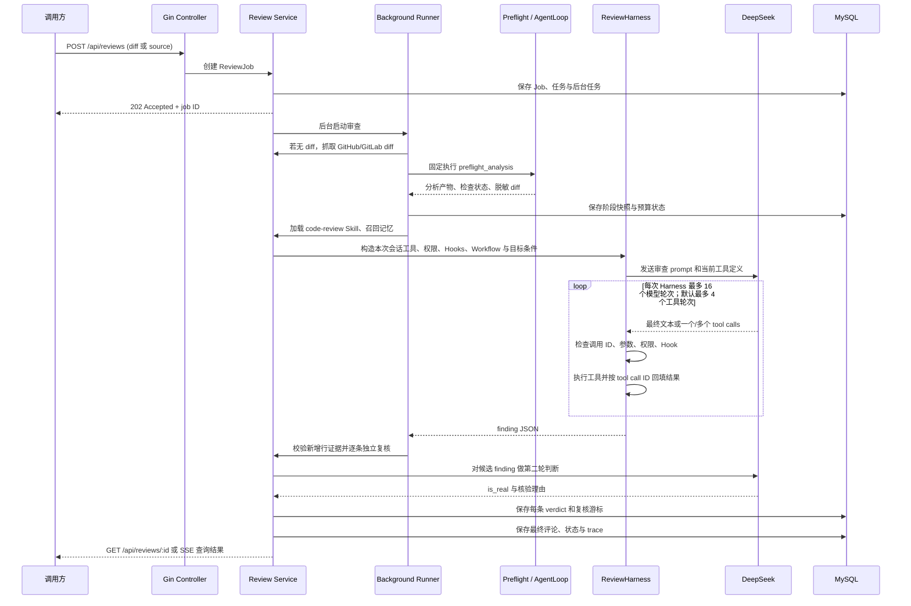

# CR-Agent 当前工具体系、工作流程与业界设计对照

> 调研基准：2026-09-25。以当前工作区 `feat/version2` 分支的代码为准；重点核对 `internal/logic`、`internal/controller`、`internal/dao` 与 `cmd/server`。本文描述代码实际路径，不把 README 中的模块清单直接视为默认运行行为。

## 结论摘要

CR-Agent 是一个**面向代码审查的受限 Agent 系统**，不是能任意操作代码库的通用 Coding Agent。整体采用混合结构：宿主代码固定安排审查生命周期，单个模型 Agent 在有限工具范围内决定何时补充上下文；模型输出之后再由程序做变更行证据校验和第二轮模型复核。

当前结构的强项是边界清晰：不让模型执行 Shell 或改仓库；前置检查、权限、工具结果回填、重试、脱敏、证据核验、检查点和追踪均有宿主控制。主审查阶段与逐条复核结果可在进程中断后恢复；模型服务与数据库之间仍存在无法原子提交的单次调用窗口。其他差距包括：MCP 还没有真实传输或真实外部 MCP 服务；需要审批的工具目前只是被拒绝，不存在可等待和恢复的审批流程；评测集仍小且使用规则化匹配。

**特别说明：**代码中确有 Team / specialist 模块，但当前默认审查入口调用的是 `RunReviewAgent` 单 Agent 路径，并没有调用 `ReviewTeam.Run`。MCP 名称和接口已搭好，但内置 `docs`、`deploy` 都是进程内模拟，不会访问真实文档平台或部署平台。

## 1. Agent 能调用哪些工具

工具有三层：默认 Agent 工具、按会话添加的工具，以及连接 MCP 后动态加入的工具。前置分析和最终核验也是审查能力，但它们由服务编排，**不在模型可选工具池里**。

### 1.1 Harness 内置工具

| 工具 | 用途 | 运行边界 |
|---|---|---|
| `connect_mcp(name)` | 连接已在宿主注册的 MCP server | 当前只允许 `docs` 和 `deploy` 两个模拟服务 |
| `Workflow(name, args, resume_from_run_id)` | 启动或续跑宿主注册的 workflow | 不能由模型提交脚本；目前只注册 `review-changes` |
| `read_archive(reference)` | 读取当前会话归档的较大工具结果或历史 | 只有产生归档后才进入工具池；引用不能跨会话使用 |

### 1.2 每次代码审查添加的工具

| 工具 | 用途 | 权限 / 限制 |
|---|---|---|
| `load_skill(name)` | 按名读取 Skill 完整内容 | 只读取配置的 Skills 目录 |
| `memory_recall(query)` | 查询与审查相关的长期记忆 | 使用项目本地 `.memory` 存储 |
| `todo_write(items)` | 替换本次模型会话中的计划文本 | 会话局部状态，不是持久任务计划 |
| `typecheck()` | 编译 PR 固定 head 的 Go module | E2B 沙箱固定执行 `go build ./...`；要求固定 PR head、根目录 `go.mod` 和 Go 运行时；不运行仓库测试，也不接收模型命令 |
| `background_check(check)` | 异步读取已完成的前置检查结果并通知会话 | 不会重新执行静态检查；对已有结果做后台转交 |
| `create_task(subject)`、`list_tasks()` | 创建、列出本会话子任务 | 模型只能列出本会话创建并登记所有权的任务 |
| `get_task(task_id)`、`claim_task(task_id)`、`complete_task(task_id)` | 查询、认领、完成本会话子任务 | 不能操作其他会话任务 |
| `update_task(task_id, blocked_by)` | 为本会话任务增加依赖 | 目标和依赖任务都必须属于当前会话；`blocked_by` 是逗号分隔 ID |
| `list_crons()` | 查看宿主定时审查计划 | 只管理代码审查计划 |
| `schedule_cron(cron, source)`、`cancel_cron(cron_id)` | 创建、取消定时计划 | 需要 `manage_schedule` 授权；默认策略要求审批，但当前执行器不提供交互审批，因此会被拒绝 |

`load_skill`、`memory_recall` 等工具虽然对模型开放，服务在调用 Agent 前也会自动加载 `code-review` Skill 并做一次记忆召回。工具调用不是审查的唯一信息来源。

### 1.3 统一工具元数据

`ToolMetadata` 统一描述名称、用途、JSON Schema 和权限；`ToolDefinition` 再绑定宿主 handler。AgentLoop、ReviewHarness 和 MCP 适配都使用这一结构，注册阶段编译 schema 并验证必需字段，handler 执行前完整校验参数；外部 `$ref` 不会触发资源加载。Harness 从注册表动态生成 Eino `ToolInfo`。新增模型工具可以只补定义和 handler，由现有分发器负责权限、Hook、调用结果与 trace。

### 1.4 MCP 动态工具

调用 `connect_mcp` 后，Harness 下一轮才会把该 server 的工具加入模型可见工具列表。名称经过规范化并加上 `mcp__<server>__<tool>` 前缀。当前工具如下：

| MCP 工具名 | 用途 | 实际行为 |
|---|---|---|
| `mcp__docs__search(query)` | 搜索代码审查文档 | 返回拼接的模拟搜索文本，不访问文档系统 |
| `mcp__docs__get_version()` | 查看文档 API 版本 | 固定返回 `docs-api v1` |
| `mcp__deploy__status()` | 查看部署状态 | 固定返回 `web status: healthy` |
| `mcp__deploy__trigger(service)` | 触发部署 | 固定返回队列模拟文本，不触发真实部署；宿主权限默认要求审批，所以当前 Harness 会拦截 |

服务端持有 MCP 权限策略。`readOnlyHint`、`destructiveHint` 只是 server 提供的元数据，不构成授权。未知的 server/tool 默认要求审批。

### 1.5 模型工具池之外的内部能力

这些步骤是服务端代码直接执行的，不由模型在每轮自由选择：

- `diff_fetcher`：当请求只给 `source` 时，抓取 GitHub PR 或 GitLab MR diff。只接收 HTTPS 且限制在 `github.com`、`gitlab.com`，diff 最大 5 MiB。
- `preflight_analysis`：固定的 `AgentLoop` 步骤，解析变更文件、新增行、依赖文件，并扫描 diff 新增行中的疑似密钥；对提交给模型的 diff 做脱敏。前置检查不是完整构建或测试，`automated_tests` 明确记录为 `not_run`。
- 初始 `code-review` Skill 加载和记忆召回。
- `finding_verification`：模型报告 finding 后，先要求其文件、行号和证据能对应到 diff 新增行，再为每条候选单独调用模型核验触发条件与影响；最后去重、规范严重级别并脱敏。
- 审查结束后的记忆提取：只从高置信度的已确认 finding 中尝试提炼长期信息。

## 2. 整体执行流程

### 流程说明

1. `POST /api/reviews` 接受 `diff` 或 `source`，创建 Job、任务和后台任务后返回 `202`。`source` 抓取只支持 HTTPS 的 GitHub PR / GitLab MR 链接。
2. 后台 Runner 设置 Job 为运行中；若未直接提供 diff，则按白名单抓取。GitHub 优先走配置的 REST API diff endpoint，失败时回退到 `.diff` 地址；GitLab 使用 MR `.diff`。
3. 宿主通过固定 `preflight_analysis` 解析 diff、执行轻量检查和原始新增行密钥扫描。分析结果可缓存，但密钥扫描每次都会对原始 diff 执行；原始密钥值不应进入分析缓存或模型提示。
4. 服务自动加载 `code-review` Skill 并召回记忆，随后由 `RunReviewAgent` 将脱敏后的完整 diff 一次交给本次 Harness 会话，不再按 28,000 字节切片审查。Agent 工具提示要求只读审查、只在缺证据时调用工具，并明确禁止把 MCP 模拟输出当作审查事实。
5. Harness 每轮重建当前可见工具池，将工具定义传给 Eino 模型适配层。工具按宿主串行执行；模型单轮最多提出 32 个调用。工具执行前检查权限并触发 Hooks，结果会脱敏后按原始 tool call ID 返回模型。推理重试发生在模型请求边界，不会重放已执行工具。
6. 每次 Harness 会话的工具调用默认最多 4 轮、连续无进展最多 2 轮，模型总轮次默认上限 16。超长工具结果可归档并通过 `read_archive` 恢复；上下文压缩保留完整 assistant/tool 轮次，避免破坏 provider 的调用配对。
7. 模型最终输出必须解析为 finding JSON。程序要求 finding 对应变更新增行，再逐条用局部 diff 片段做独立模型复核。证据未通过或核验不完整时，Job 以 `completed_with_warnings` 等状态表达未完成，不把缺少证据的文本直接当成确认评论。
8. 若请求带有 `goal`，独立的无工具判断器会在 Agent 看似结束后核对目标是否满足；未满足时把反馈送回同一会话继续，直到目标通过或到达限制。

## 3. MCP 调用了哪些外部服务

**当前 MCP 没有调用任何真实外部服务。** `newDocsMCPServer` 和 `newDeployMCPServer` 都在进程内创建 `MCPClient` 并注册本地 handler；代码未见 stdio 子进程、Streamable HTTP 请求、MCP 初始化/协商、远端 endpoint 或真实文档/部署 SDK。它们是用来验证动态发现、调用和权限边界的模拟 server。

项目的真实外部依赖如下：

| 服务 | 何时调用 | 代码用途 |
|---|---|---|
| DeepSeek API | 需要运行审查、第二轮复核、Workflow Agent 或记忆提取时 | Eino OpenAI-compatible 适配层默认使用 `deepseek-flash`；审查请求开启 high 思考强度。模型、base URL 和 API key 分别来自 `DEEPSEEK_MODEL`、`DEEPSEEK_BASE_URL` 和 `DEEPSEEK_API_KEY` |
| GitHub REST API / GitHub `.diff` | 请求给 GitHub PR URL 且未直接给 diff 时 | 拉取 PR diff；可选使用 `GITHUB_TOKEN`，API base 可配置 |
| GitLab MR `.diff` | 请求给 GitLab MR URL 且未直接给 diff 时 | 拉取合并请求 diff；配置中没有单独的 GitLab token |
| MySQL | 服务启动及请求持久化时 | 生产环境强制要求 `PERSISTENCE_MODE=mysql` 和 `MYSQL_DSN`；保存审查 Job、任务/后台任务和 Workflow 运行数据 |

Redis 目前只有配置字段，未发现当前运行路径连接 Redis。审查记忆和 durable Cron 计划仍写本地 `.memory`、`.cron-jobs.json`；它们不是上述 MySQL 事实存储的一部分。`cmd/server` 通过 Gin 路由注册 API，但当前仓库代码未看到这些路由前面的身份认证中间件；若部署依赖网关认证，应在部署架构中另行确认。

## 4. 当前整体设计

### 4.1 分层

- **接口层**：`internal/controller/review.go` 提供 Review、memory、任务、后台任务和 Cron HTTP API。
- **服务编排层**：`internal/logic/service.go` 控制审查 Job 生命周期、前置检查、Agent 调用、finding 复核和记忆提取。
- **Agent Harness**：`internal/logic/harness.go` 管理模型工具循环、动态工具池、权限与 Hook、工具结果配对、归档、目标停止条件。
- **适配器层**：`internal/logic/eino_agent.go` 把单次推理接到 DeepSeek OpenAI-compatible API；`internal/logic/mcp.go` 抽象 MCP server、工具发现、命名和授权。
- **数据层**：`internal/dao` 实现 MySQL 存储；部分状态和非生产/测试适配器仍使用文件。

### 4.2 重要取舍

- **工作流和 Agent 混合**：整个审查生命周期是宿主固定编排；Agent 只在审查阶段自主决定是否调用可用工具。`review-changes` Workflow 是模型可选的宿主脚本，不等于主服务默认改走 Workflow。
- **单 Agent 是当前默认，不是 Team**：审查入口调用 `RunReviewAgent`。`ReviewTeam`、三类 specialist 和团队消息代码仍在仓库，但默认 `runWithTracer` 没有调用它们。当前默认路径的“第二轮复核”是逐条独立 verifier 调用，也不等于三个并行 reviewer。
- **能力受限且偏只读**：没有仓库检出、文件读取/修改、Shell、测试运行、PR 发布或任意命令执行。对 diff 做审查不需要开放这些能力；若目标变成自动修复 Agent，才需要单独设计沙箱、worktree、测试反馈与变更审批。
- **恢复能力分层**：生产 Workflow 有 MySQL snapshot/event、稳定调用键和 Lease，支持复用已完成的子 Agent 结果。主审查另在 MySQL 保存脱敏输入、已完成阶段结果、逐条 finding verdict、复核游标和模型预算预留；重启后从最近持久化阶段继续。Harness 的完整消息历史仍不落库，因此首轮模型会话若在候选结果写入检查点前中断，会重跑该未完成阶段。模型服务与数据库之间没有分布式事务；当前外部请求按至少一次语义恢复，无法保证恰好一次。
- **权限策略并非交互审批**：`allow` 会执行，`deny` 或 `require_approval` 在当前 Harness 都会转成工具错误；代码没有待审批记录、通知 UI、审批后恢复工具调用的完整状态机。
- **观测和评测已起步**：模型请求、工具调用、核验和状态仍记录在原始 trace 中；用户界面隐藏难以解释的逐条 `model_request` / `deepseek_chat` 事件，保留模型请求次数和耗时汇总。当前 21 例合成 diff benchmark 可观测 precision/recall、变更行定位、trace 完整度和脱敏 canary，但每例只跑一次，按 fixture phrase group 做规则匹配。
- **模型长度预算分开控制**：通用模型输出上限由 `MODEL_MAX_OUTPUT_TOKENS` 配置，默认 65,536；代码审查与 finding 复核对 DeepSeek 请求服务商允许的最大输出 393,216，并启用 high thinking 模式。截断恢复不再逐级降低输出上限；任务费用预算仍会按剩余额度限制单次输出预留。备用 OpenAI 兼容模型仍使用 `MODEL_MAX_OUTPUT_TOKENS`。本地上下文字符预算默认 500,000。完整 diff 若超过单次请求可承载的上下文，仍会失败；不能保证任意大小的 PR 都能一次送入模型。
- **预算按任务执行**：Review Job 可设置人民币上限，模型调用按 usage 与配置费率核算并在请求前预留费用；trace 保存 token 数、模型和费率快照。计量按高峰/缓存未命中单价保守估算，未和供应商账单对账。独立 benchmark 仍只有请求数与 token 计数上限，没有费用账单。

## 5. 与业界常见 Agent 设计的对照

业界没有单一的“标准 Agent 架构”。官方资料通常把 Agent 描述为模型在环境反馈下循环调用工具；当任务边界清晰时，简单、固定工作流可能更可靠。OpenAI Agents SDK 将工具循环、MCP、handoff、guardrails、session、人类介入和 tracing 作为可组合运行时能力；LangGraph 用 checkpoint 与 store 区分会话状态和跨会话长期记忆。以下比较的是代表性设计方向，不是所有产品必须采用的清单。

| 维度 | CR-Agent 当前情况 | 代表性行业设计方向 | 评估 |
|---|---|---|---|
| Agent 控制权 | 宿主控制审查阶段和最终核验；模型仅在有限工具循环内选工具 | 按问题选择固定 workflow、单 Agent loop 或多 Agent handoff；逐步增加复杂度 | 对只读审查是合理的受限 Agent 形态；不应被描述为完全自主的 Coding Agent |
| 工具接口 | 本地 Go handler + JSON Schema；当前 MCP server 是进程内模拟 | Function/local/hosted tools、MCP tools；明确工具用途、参数、回传信息，并按任务逐步扩面 | Harness 循环具备真实基础；MCP 连接与真实服务生态尚未完成 |
| MCP 互操作 | 只实现了进程内 list/call 类边界，没有协议 transport | MCP 规范定义 stdio 与 Streamable HTTP 等传输，允许客户端与独立 server 交互 | 当前是 MCP 适配层原型，不能宣称已集成外部 MCP server |
| 多 Agent | 三个审查方向和 `ReviewTeam` 代码存在，但不是默认主路径 | 需要专才所有权清楚时使用 manager/handoff；可并行时拆分并聚合 | 现阶段以单 Agent + 逐条 verifier 为主；没有必要为了“像业界”而默认启用 Team |
| 状态和恢复 | Workflow 与 Review 阶段都可 MySQL 恢复；逐条 verifier 结果与游标持久化，外部请求仍有一个可能重试的窗口 | Checkpoint 持久化 thread/run 状态，长期 Store 保存跨会话数据，并设计中断与人工恢复 | 主流程阶段恢复已落地；完整 Harness 消息历史不落库，不能从模型会话内部轮次继续 |
| 安全 | diff 脱敏、工具权限、Hook、输入视作不可信、finding 行证据校验；没有写代码能力 | 按工具调用做输入/输出 guardrail，危险操作接入人工批准；执行代码时放入隔离 sandbox | 只读审查已有较好边界；审批闭环和 HTTP 身份认证是需要补齐/确认的生产边界 |
| 可观测与评估 | 自建 trace；小规模 benchmark 有多项指标 | trace 覆盖模型、工具、handoff、guardrail，使用任务集反复 eval 并据此调整工具与流程 | 结构有了，评估代表性和重复性不足；不能从一次合成集推断线上召回率或成本 |
| 记忆 | 本地文件长期记忆 + 当前进程中的 Harness 对话 | 会话 checkpoint 与跨会话 store 分开管理 | 概念上已有 recall/store，但本地记忆不适合无共享盘的多实例部署；对话状态不持久 |

### 总体判断

和常见 Agent Runtime 相比，CR-Agent **核心 tool loop、权限检查、结构化输出、trace、workflow persistence 和主审查阶段恢复等基础能力已经存在**；差距主要不在“还少多少种 Agent 名词”，而在真实运行时完整性：MCP 外部互操作、完整模型会话历史恢复、能恢复的人工审批、多实例 API 身份与授权、代表性评测和费用对账。

对其当前代码审查产品目标而言，强制引入 Shell、文件修改或常驻多 Agent Team 并不会自动提高质量，也会扩大风险面。更重要的是让现有只读结果稳定、可复核、可恢复，并用真实评测证明每个新增复杂度有收益。

## 6. 当前本地评测能说明什么

仓库包含 21 例小型合成 Go diff（14 个标注 issue、9 个负例）。最近单 Agent 结果记录为：Precision **61.5%**、Recall **57.1%**、F1 **59.3%**、变更行定位 **100%**、trace 完整度 **100%**，21/21 任务完成。结果文件指出匹配方法是 fixture 专属短语组加文件和 ±2 行范围，一例一次运行。

因此这份结果适合定位漏报、误报和回归；不等价于人工标注的真实 PR 质量，不足以比较不同模型/Agent 架构的稳定性，也不能和 SWR-Bench、CodeReviewBench 等数据集的数字直接比较。团队专项路径的一次结果虽有较高 Recall，但 Precision 和 F1 更低、模型请求与耗时明显更高；由于只有一次小样本且不是当前默认路径，这只能作为继续评估并行审查开销与误报率的提示。

## 7. 建议的改进顺序

1. **先补生产边界**：为 HTTP API 明确身份、租户和资源授权；把 `require_approval` 变成可等待、可审计、可恢复的审批状态，或对当前确实不支持审批的工具明确禁用。
2. **继续完善作业恢复**：若要在 Harness 内部轮次级别恢复，需持久化完整对话、工具结果和稳定调用键；当前方案按 Review 阶段和 finding 粒度恢复，并对尚无持久结果的外部调用采用至少一次语义。相关字段、入口与恢复边界见 [`docs/review-recovery.md`](review-recovery.md)。
3. **接入真实 MCP transport**：实现 stdio 和/或 Streamable HTTP client、认证/凭据管理、超时取消、连接与版本协商、schema 校验、错误分类；用真实的只读文档服务做端到端集成。部署写工具先保留 deny，直到审批链路工作。
4. **扩展评测而非堆工具**：补真实 PR 历史和完整仓库上下文，加入人工判定或独立语义判分，覆盖 Go 以外语言、不同 diff 规模、重复运行、token/美元成本及延迟分布。
5. **让配置和运行事实一致**：将预算估算与供应商账单对账，明确 Redis 是否移除或集成；评估 Memory/Cron 本地文件在多实例下的读写和重复触发语义。
6. **仅在需求转为自动修复时扩展执行能力**：届时增加隔离工作区/worktree、只读与写工具分权、测试结果反馈、变更 diff 展示和人工合并控制；不要把这些能力混进当前只读审查 Agent 的默认工具池。

## 8. 代码入口索引

| 主题 | 代码 |
|---|---|
| Review Job、前置流程、证据核验 | [`internal/logic/service.go`](../internal/logic/service.go) |
| 工具元数据与宿主注册表 | [`internal/logic/agent_loop.go`](../internal/logic/agent_loop.go) |
| Harness 工具循环、通用注册表分发、上下文压缩 | [`internal/logic/harness.go`](../internal/logic/harness.go) |
| 当前审查会话的 Skill、Memory、Task、Cron 工具 | [`internal/logic/harness_service.go`](../internal/logic/harness_service.go) |
| MCP server 注册、动态工具池和权限策略 | [`internal/logic/mcp.go`](../internal/logic/mcp.go) |
| Go typecheck 沙箱命令 | [`internal/logic/sandbox_runner.go`](../internal/logic/sandbox_runner.go) |
| Eino / DeepSeek 适配、重试与 token 截断处理 | [`internal/logic/eino_agent.go`](../internal/logic/eino_agent.go) |
| 固定前置分析与密钥扫描 | [`internal/logic/preflight.go`](../internal/logic/preflight.go) |
| GitHub/GitLab diff 抓取 | [`internal/logic/fetch.go`](../internal/logic/fetch.go) |
| Review Workflow | [`internal/logic/workflow_review.go`](../internal/logic/workflow_review.go)、[`internal/logic/workflow.go`](../internal/logic/workflow.go) |
| 专项 Agent / Team（非当前默认路径） | [`internal/logic/subagent.go`](../internal/logic/subagent.go)、[`internal/logic/team.go`](../internal/logic/team.go) |
| HTTP API | [`internal/controller/review.go`](../internal/controller/review.go) |
| 生产启动、MySQL 注入 | [`cmd/server/main.go`](../cmd/server/main.go) |
| Benchmark 定义和局限 | [`benchmarks/README.md`](../benchmarks/README.md)、[`benchmarks/results/run-20260923T062238Z-single.md`](../benchmarks/results/run-20260923T062238Z-single.md) |

## 9. 参考资料

- Anthropic, [Building effective agents](https://www.anthropic.com/engineering/building-effective-agents)：区分 Workflow 与 Agent，并建议从满足需求的最简单方案开始，依据效果再增加复杂度。
- Anthropic, [Writing effective tools for agents](https://www.anthropic.com/engineering/writing-tools-for-agents)：工具选择、命名边界、结果上下文、token 效率、工具描述和 evaluation。
- OpenAI, [Agents SDK](https://openai.github.io/openai-agents-python/) 与 [Agents SDK tools](https://openai.github.io/openai-agents-python/tools/)：工具循环、MCP、handoff、guardrails、session 与 tracing 等运行时能力。
- OpenAI, [Guardrails](https://openai.github.io/openai-agents-python/guardrails/) 与 [Tracing](https://openai.github.io/openai-agents-python/tracing/)：工具级前后置 guardrail，以及模型/工具/handoff/guardrail trace 的组织方式。
- CloudWeGo Eino, [`schema.ToolInfo`](https://github.com/cloudwego/eino/blob/main/schema/tool.go)：以名称、用途描述和参数 schema 向 ChatModel 提供工具契约。
- Go JSON Schema, [`santhosh-tekuri/jsonschema/v6`](https://github.com/santhosh-tekuri/jsonschema)：实现 Draft 2020-12 等多个版本的 schema 编译和实例验证；工具注册使用该库并禁用外部资源加载。
- Go, [`go/types`](https://pkg.go.dev/go/types)：标准库的 Go package 类型检查器；完整包集合可通过 `go/packages` 加载。本项目的 PR 检查在隔离沙箱运行 `go build ./...`，让 Go 工具链按 module 和 build tags 检查完整 package 集合。
- LangChain, [LangGraph Persistence](https://docs.langchain.com/oss/python/langgraph/persistence)：用 thread-scoped checkpoint 支持连续性、恢复与人工介入；用长期 store 管理跨会话信息。
- Temporal, [Durable Execution](https://docs.temporal.io/) 与 [Activities](https://docs.temporal.io/activities)：通过执行历史恢复 Workflow；外部调用拆为独立 Activity，建议幂等，并记录结果与重试状态。
- Azure Durable Task, [Durable orchestrations](https://learn.microsoft.com/en-us/azure/durable-task/common/durable-task-orchestrations)：在 await/yield 边界持久化执行历史，恢复时重放已完成 Activity 的结果，并要求编排代码保持确定性。
- Model Context Protocol, [Transports](https://modelcontextprotocol.io/specification/2025-11-25/basic/transports) 与 [Tools](https://modelcontextprotocol.io/specification/2025-11-25/server/tools)：MCP 标准传输、工具发现/调用和安全交互模型。
- DeepSeek, [Chat Completions API](https://api-docs.deepseek.com/api/create-chat-completion/)：`max_tokens` 限制生成 token 数，输入和生成结果合计仍受模型上下文窗口约束；`usage.completion_tokens` 是实际生成 token 数。

## 10. 历史 Trace 中重复的 `deepseek_chat` 与 `input` 字段

以下解释针对改动前的样例 `task_e0c850c2`（GitHub PR #195），用于说明用户当时看到的现象。样例中的 `deepseek_chat` 事件都是 `kind=model_request`，不是模型调用的工具，也不是 MCP 调用。`EinoReviewAgent` 使用 `deepseek-chat` 模型，并把每一次 HTTP 推理请求命名为 `deepseek_chat`；旧版一次审查会有多个推理请求，因此 Trace 重复出现这个名字。

该样例记录了 **5 个** `deepseek_chat` 请求：4 个挂在 `review_agent` span 下，1 个挂在 `finding_second_pass_verification` span 下。后一个是候选 finding 的独立复核。前 4 个都显示 `round=1`，且没有非零 `retry_count`，说明它们不是同一个 Harness 会话里的第 1、2、3、4 轮重试：旧版 `RunReviewAgent` 把 diff 切成最多 28,000 字节的分片，并逐片调用 `EinoReviewAgent`；每次 `EinoReviewAgent` 都新建本地轮次计数器，因此每个分片的第一请求会重新显示 `round=1`。格式修复也会新建一次推理调用。样例 Trace 没有记录 `chunk_index` 或 `operation=review/repair`，所以仅凭这份记录不能断定四个请求全是四个分片，还是其中一次属于 JSON 格式修复；代码结构表明它们是独立调用，而不是某个单一请求被重复显示。

其中三次请求的 `output_tokens=1` 不一定代表模型只做了“一 token 推理”。程序直接记录 provider 返回的 `completion_tokens`；非常短的输出（例如一个空数组）可能确实只有一个 token。由于每个请求的原始回复未单独保存，这个样例无法确认它们是否都返回了空数组；这只是与单 Agent 汇总结果相符的一种解释。

样例中的 `input` 字段也不是模型收到的 prompt。`observedModelRequest` 把 Trace span 的 `input` 写成 `max_tokens=4096`；这代表当时的最大生成 token 数，不是输入 token 数。模型实际收到的 messages（系统提示、Skill、diff 分片及审查上下文）没有写入这个请求 span。旧版前端把所有事件的通用 `input` 字段统一显示为“输入”，所以调用预算元数据容易被误认为模型上下文。现在 UI 不再展示这种逐条模型请求事件；原始 trace 仍保留，供后端诊断和审计使用。完整 prompt 未持久化，也不能从该字段还原。

### 这个样例还有一处实际结论不一致

`finding_second_pass_verification` 的 `model_reply` 结构化字段是 `"is_real": true`，但同一 JSON 的 `reason` 表示 callee 定义没有出现在 diff 中、旧调用形式不能证明它仍是异步，并且结尾写了 `is_real 为 false`。这两部分结论冲突。当时的 `verifyFindingIndependently` 只解析 `is_real` 布尔值并返回它；服务随后据此把 finding 标为 `second_pass_review_passed`，没有校验 reason 是否支持该布尔值。于是这条评论进入最终结果，尽管复核理由实际说明证据不足。后续证据匹配与三态复核方案见[代码审查证据核验排障与方案](review-verification-research.md)。

这不是 Trace 把模型的 `false` 改成了 `true`：JSON 的顶层布尔值原本就是 `true`。更准确地说，这是模型在结构化字段与自然语言理由之间自相矛盾，而当时的应用只信任布尔字段。当前复核输出已改成 `confirmed` / `rejected` / `inconclusive`；理由与结构化字段的自动一致性诊断仍可作为后续改进，不应只靠解析中文关键词决定是否发布。

### 这次改动与后续建议

- 用户事件列表、搜索与时间线隐藏逐条 `model_request`，避免展示无法说明具体动作的 `deepseek_chat` 和易误解的 `input: max_tokens=4096`。后端原始 trace 不删，界面仍显示模型请求次数与耗时汇总。
- 审查 Agent 不再按 28,000 字节分片，而是一次提交完整脱敏 diff。模型工具循环、格式修复、finding 独立复核等仍可能产生额外模型请求；用户不应据请求次数推断“重复审查”。
- `MODEL_MAX_OUTPUT_TOKENS` 默认 65,536；主模型 DeepSeek 的代码审查与 finding 复核请求 393,216 个输出 token（当前 Flash/Pro API 上限），不再使用较低的 review 专用上限或降档重试。任务费用预算仍限制请求前预留额度；备用 OpenAI 兼容模型沿用 `MODEL_MAX_OUTPUT_TOKENS`。本地上下文字符预算默认 500,000。若完整 diff 超过模型上下文，仍会明确失败，不能把“单次提交”理解为无限输入。
- 若以后要重新在用户界面展示逐条模型请求，先在后端补 `operation`（审查、格式修复、finding 复核、goal evaluator、记忆提取）、provider/model、attempt/retry 等有意义的字段，并明确 `round` 的作用域、实际 prompt 不持久化。当前不再需要 `chunk_index/chunk_total` 作为审查路径的展示字段。
- 对模型返回的结构化 verdict 和说明文本做一致性诊断；出现冲突时将该 finding 置为 `insufficient`，不要仅凭布尔值自动确认为真实问题。

对应代码入口：[`internal/logic/eino_agent.go`](../internal/logic/eino_agent.go) 的请求 span 和轮次计数、[`internal/logic/subagent.go`](../internal/logic/subagent.go) 的完整 diff 审查/格式修复、[`internal/logic/finding_verification.go`](../internal/logic/finding_verification.go) 的 verdict 解析、[`web/assets/js/view.js`](../web/assets/js/view.js) 的 trace 展示。
